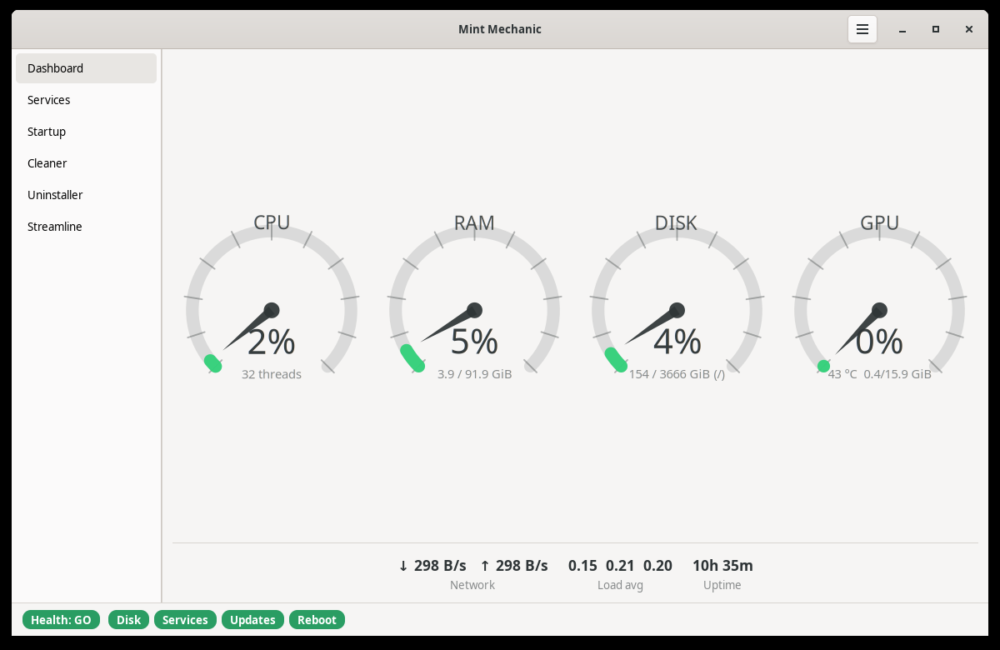
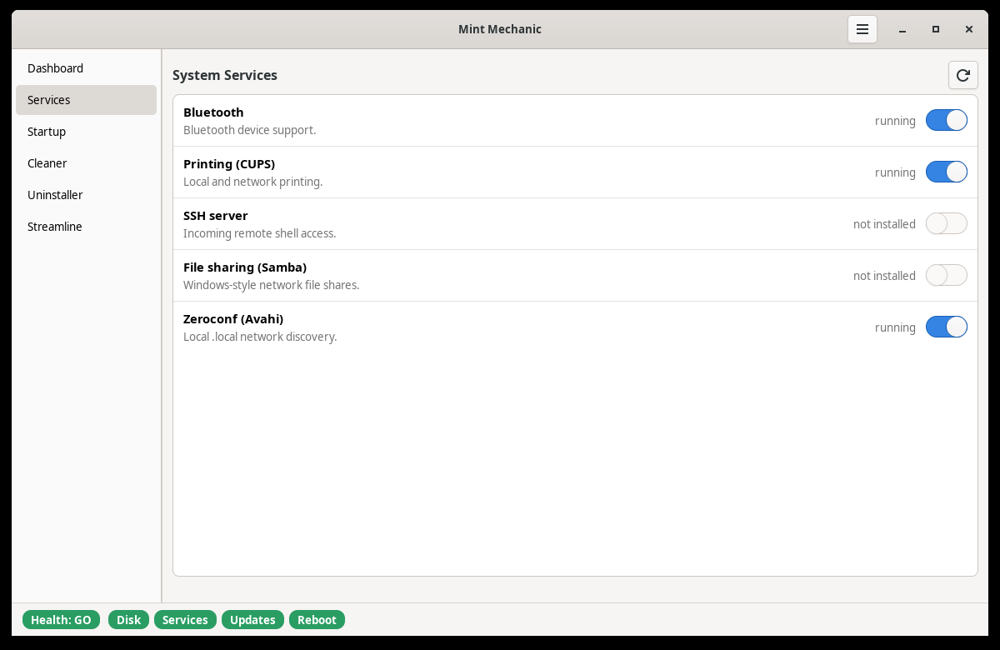
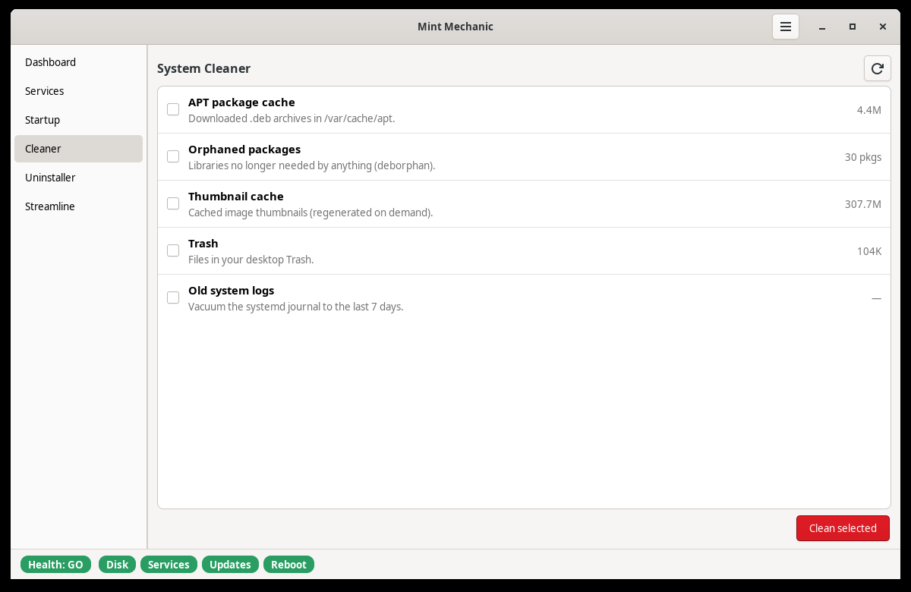
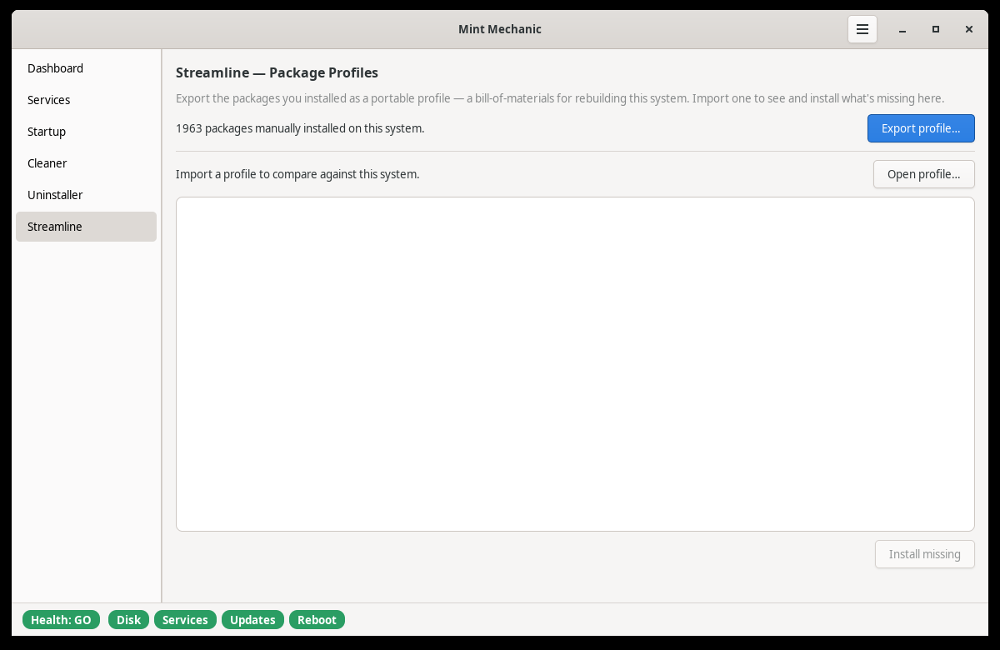

# Mint Mechanic

[](https://github.com/rclinux/mint-mechanic/actions/workflows/ci.yml)

**The maintained tune-up tool for Linux Mint.** A modern, Cinnamon-native
successor to [Stacer](https://github.com/oguzhaninan/Stacer) (GPL-3.0, abandoned
since 2019): a live system dashboard with animated **CPU / RAM / Disk gauges
plus the GPU dial Stacer never had**, married to the *action* features Mint
doesn't ship — and topped with package-profile export tied to disaster recovery.



> Command: `mint-mechanic`. Linux Mint 22.x / Cinnamon, GTK 4.

## Why

- **Stacer is abandoned** (last release May 2019, Qt/C++) — a clear succession
  opening, and its beloved analog-gauge dashboard deserves a maintained heir.
- **Mint 22.3 "Zena" owns system *info*** (its read-only System Information
  tool). Mint Mechanic deliberately does **not** compete there — it lives in the
  **action / optimization** lane Mint leaves open.
- Differentiators neither Stacer nor Mint has: **Streamline** package profiles
  (a portable bill-of-materials for from-scratch rebuilds), a GO/NO-GO health
  read, and one-click launch into the sibling
  [disk-recovery-tool](https://github.com/rclinux/disk-recovery-tool).

## Features

- **Dashboard** — live analog gauges for CPU, RAM, Disk, and **GPU** (NVIDIA
  now; the reader is behind a seam for a future AMD swap), with network
  throughput, load average and uptime readouts. The needle *eases* toward each
  reading and the animation timer idles when the system is steady.
- **Services** — enable/disable systemd services with live status (the GUI Mint
  lacks). Unavailable units show "not installed" with the toggle disabled.
- **Startup** — toggle or remove your per-user autostart entries.
- **Cleaner** — reclaim space: APT cache, orphaned packages (deborphan),
  thumbnail cache, Trash, and old system logs, each with a measured size. The
  orphan purge always shows you apt's **full** removal cascade first and refuses
  outright if it would take your desktop, login manager or graphics driver with
  it — `deborphan`'s shortlist is not the real blast radius.
- **Uninstaller** — search the manually-installed package set and remove or
  purge a selection. Like the Cleaner, it shows apt's full removal cascade
  before doing anything and refuses selections that would take session-critical
  packages with them — selecting one package rarely means removing only one.
- **Streamline** — export your manually-installed package set to a portable,
  timestamped manifest, or import one to diff against this machine and install
  what's missing.
- **Health strip** — a persistent GO / NO-GO band along the bottom: root disk,
  failed units, pending updates and reboot-required, rolled up to one verdict.

|  |  |
|--|--|
|  |  |
|  | |

## Design principles

- **Compete in the gap, not the overlap.** Actions + gauges; ignore system info.
- **One package-manager abstraction** (`ltt/pkg.py`) from day one — every
  install/remove/query routes through it. (v1 is apt/Mint-only; the seam lets a
  dnf/pacman backend drop in later.) This is the lesson learned from the Arch
  Linux Tweak Tool, which hardcodes pacman ~115× across 44 files.
- **Data-driven features** — a toggle/app is a dict consumed by one generic row
  builder; adding a feature is adding a data row.
- **No blanket root.** Reads run as the user; mutating actions elevate
  per-action via pkexec.
- **Independent sibling, not a monolith.** Mint Mechanic does not absorb
  disk-recovery-tool or workstation-dashboard — it launches/links to them.

## Requirements

Python 3, GTK 4 + PyGObject, `python3-psutil`, and polkit (`pkexec`) for
per-action elevation. Optional: `deborphan` (the Cleaner's orphaned-package
task) and `nvidia-smi` for the GPU dial (absent → the dial simply hides). Linux
Mint 22.x / Cinnamon.

## Install

**From the PPA (recommended)** — you get updates, including security fixes,
through your normal system updates:

```bash
sudo add-apt-repository ppa:rclinux/mint-mechanic
sudo apt update
sudo apt install mint-mechanic
```

Mint 22.x is built on Ubuntu 24.04 "noble", which is what the PPA targets.

> **Why a PPA rather than a downloaded `.deb`?** A downloaded package has no
> update path — if a security fix ships, nothing tells you and nothing installs
> it. Through the PPA, fixes arrive with your regular updates. Launchpad builds
> and signs the packages from published source, so the maintainer's signing key
> never touches a build server.

**Build a `.deb` yourself** — no PPA required, but no automatic updates either:

```bash
./build-deb.sh
sudo apt install ./dist/mint-mechanic_0.8.0_all.deb
```

**Make-install path** — the same system layout without building a package:

```bash
sudo ./install.sh      # installs dependencies + files
sudo ./uninstall.sh    # removes them (leaves dependencies)
```

**Run from the dev tree** (no install):

```bash
./bin/mint-mechanic
```

Launch with `mint-mechanic` or from your application menu. **Don't run it as
root** — it elevates the individual mutating actions via pkexec itself.

## Development

```bash
pytest -q            # test suite (no display or PyGObject needed)
ruff check .         # lint
./build-deb.sh       # build a binary .deb locally
./build-source.sh    # build a source package for the PPA
```

Packaging metadata lives in `debian/` and nowhere else — `build-deb.sh` is a
thin wrapper around `dpkg-buildpackage`, so a local build and a PPA build cannot
disagree. Releasing to the PPA:

```bash
./build-source.sh --sign
dput ppa:rclinux/mint-mechanic ../mint-mechanic_<version>_source.changes
```

The suite covers the backend seams — the apt abstraction, profile export/import,
cleaner tasks, systemctl state parsing, and metrics degradation — and is
deliberately GTK-free so it runs headless in CI. Anything that builds an
elevated command line is expected to arrive with a test.

Package names bound for an elevated `apt-get` are validated in one place
(`ltt/pkg.py`) and every mutating argv terminates its options with `--`. A
Streamline profile is portable and hand-editable, so it is treated as untrusted
input: the import path drops entries that aren't valid package names and tells
you what it ignored.

Anything that removes packages goes through `pkg.removal_preview()` — apt's own
dry run — and must show that cascade and be confirmed. `pkg.critical_in()`
refuses sets touching the desktop, login manager, graphics driver, systemd or
NetworkManager, and `pkg.preview_failed()` makes an uncomputable preview a hard
stop rather than a silent "nothing to remove". Both the Cleaner and the
Uninstaller share that one implementation so they cannot drift apart.

## License

GPL-3.0-or-later. © Ron Craig (rclinux).
